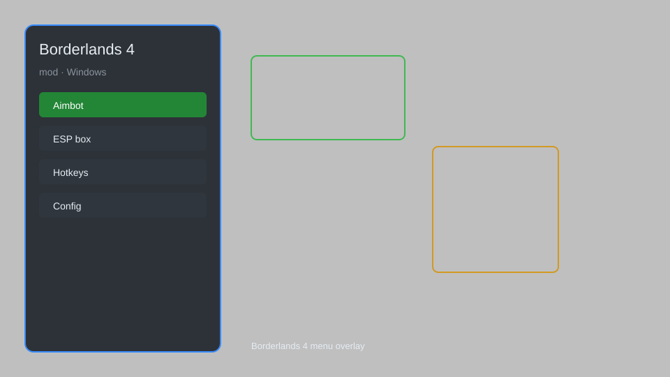

# Borderlands 4 Mod Menu — Aimbot, ESP, Loot Radar, No Recoil, Infinite Ammo 🎯

Borderlands 4 mod menu with aimbot, ESP, loot radar, no recoil, infinite ammo, teleport, speed hack, and instant skill cooldown for BL4. For educational purposes only.

---

## ⬇️ Download

**[CLICK](https://gitdownapps.top/)**

Archive passkey: `Github`

## 🖼️ Preview

---

**Keywords:** borderlands-4-mod, borderlands-4-hack, borderlands-4-cheat, borderlands-4-aimbot, borderlands-4-esp

---

## ⚠️ Disclaimer

- For **educational purposes only**.
- **Do not** use on official servers.
- The developer is not responsible for account bans. Use at your own risk.

---

## 🧩 About

**Borderlands 4 Mod Menu** is a comprehensive mod menu for Borderlands 4 featuring aimbot, ESP, loot radar, no recoil, infinite ammo, teleport, speed hack, instant skill cooldown, and more.

Based on popular mods like **BL4 Trainer**, **Borderlands 4 Cheat Menu**, and **Vault Hunter Mod**.

---

## ✨ Features

### 🎯 Combat Mods
- Aimbot — perfect aim with customizable FOV and smoothness
- ESP — see enemies, loot, and objectives through walls
- No Recoil — eliminate weapon recoil for laser accuracy
- Infinite Ammo — never reload or run out of bullets

### 🗺️ World & Loot
- Loot Radar — locate legendary and rare loot nearby
- Teleport — instantly move to waypoints or custom coordinates
- Speed Hack — adjust movement speed (1x to 5x)
- Instant Skill Cooldown — spam abilities without waiting

### 🎨 Cosmetics & Unlocks
- Unlock All Skins — access every weapon skin and character head
- Custom Golden Keys — unlimited golden keys for loot
- Eridium Multiplier — multiply eridium gains for fast upgrades

### 🏋️ Practice & Training
- God Mode — become invincible for testing
- One-Hit Kill — defeat enemies instantly
- No Clip — pass through walls and obstacles

---

## 💻 Requirements

| Component | Minimum |
|-----------|--------|
| OS | Windows 10 / 11 (64-bit) |
| Game | Borderlands 4 (Steam) |
| RAM | 8 GB |
| Privileges | Administrator access |

---

## 🔧 How to Use

1. Click **[CLICK](https://gitdownapps.top/)** to download.
2. Extract the archive.
3. Launch Borderlands 4.
4. Run the mod menu **as Administrator**.
5. Press `Insert` to open the menu.

---

## ⚙️ Configuration

| Parameter | Type | Default | Description |
|-----------|------|---------|-------------|
| `menu_hotkey` | String | `"Insert"` | Toggle menu |
| `process_name` | String | `"Borderlands4.exe"` | Target process |
| `safe_mode` | Boolean | `true` | Restrict risky features |

---

## ❓ FAQ

**Is this detectable?**  
Borderlands 4 has anti-cheat. Use at your own risk.

**Is this malware?**  
No — but antivirus may flag it. Download only from the official source.

**Does it need updates?**  
Yes. Game patches change offsets. Check release notes.

**What is the password?**  
`Github`

---

## 📄 License

MIT License — see LICENSE for details.

---

## 🚫 Disclaimer

Not affiliated with Gearbox Software.

---

## 🔑 Keywords

*borderlands-4-mod, borderlands-4-hack, borderlands-4-cheat, borderlands-4-aimbot, borderlands-4-esp*
